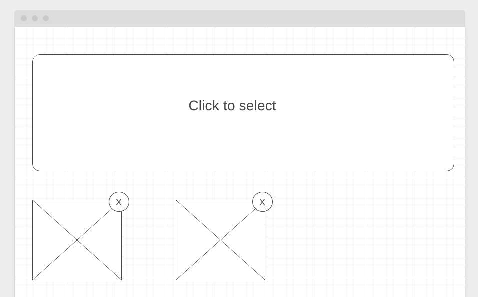

Менеджер фото
===

Вы решили модернизировать один из старых проектов и переписать его в виде React-компонентов:



## Интерфейс Менеджера фото

При клике на области "Click to select" должно появляться стандартное окно выбора файлов операционной системы, в котором пользователь может выбрать один или несколько файлов изображений (image/*).

После выбора файлов они автоматически загружаются и отображаются в виде preview фиксированного размера (нижний блок). Для отображения используйте DataURL. Новый файлы должны добавляться (не заменять предыдущие).

При клике на крестик, изображение (и все связанные с ним данные) должны удаляться.

Важно: Drag & Drop реализовывать не нужно.

## Подсказки

1. Разместите с помощью CSS блок "Click to select" над `<input type="file" />` и установите этому блоку `pointer-events: none;`, чтобы вызывать окошко выбора файлов при клике.
1. Используйте следующую заготовку, для получения DataUrl:
```js
const fileToDataUrl = file => {
  return new Promise((resolve, reject) => {
    const fileReader = new FileReader();
  
    fileReader.addEventListener('load', evt => {
      resolve(evt.currentTarget.result);
    });
    
    fileReader.addEventListener('error', evt => {
      reject(new Error(evt.currentTarget.error));
    });
    
    fileReader.readAsDataURL(file);
  });
}

const handleSelect = async (evt) => {
    const files = [...evt.target.files];
    const urls = await Promise.all(files.map(o => fileToDataUrl(o)));
    // У вас в массиве - dataUrl, можете использовать в качестве значения атрибута src тега img
}
```
