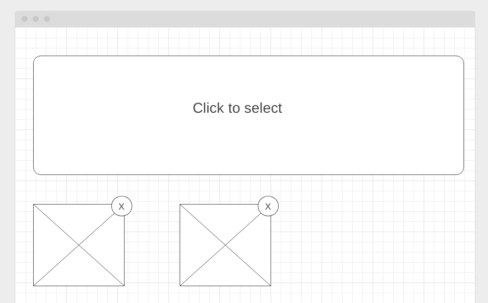

Менеджер фото
===

Вы решили модернизировать один из старых проектов и переписать его в виде React-компонентов:



## Интерфейс Менеджера фото

При клике на области «Click to select» должно появляться стандартное окно выбора файлов операционной системы, в котором пользователь может выбрать один или несколько файлов изображений (image/*).

После выбора файлов они автоматически загружаются и отображаются в виде preview фиксированного размера (нижний блок). Для отображения используйте DataURL. Новые файлы должны добавляться, а не заменять предыдущие.

При клике на крестик, изображение и все связанные с ним данные должны удаляться.

Важно: Использовать [HTML Drag and Drop API](https://developer.mozilla.org/en-US/docs/Web/API/HTML_Drag_and_Drop_API) для загрузки фото не обязательно, но будет полезной практикой.

Стили и пример разметки вы можете найти в папке [markup](./markup). Разметка дана для примера, вы можете реализовать её самостоятельно

## Подсказки

1. Разместите с помощью CSS блок "Click to select" над `<input type="file" />` и установите этому блоку `pointer-events: none;`, чтобы вызывать окошко выбора файлов при клике.
2. Используйте следующую заготовку для получения DataUrl:
```ts
const fileToDataUrl = (file: File): Promise<string> => {
    return new Promise((resolve, reject) => {
        const fileReader = new FileReader();

        fileReader.addEventListener('load', (evt: ProgressEvent<FileReader>) => {
            resolve(evt.currentTarget?.result as string);
        });

        fileReader.addEventListener('error', (evt: ProgressEvent<FileReader>) => {
            reject(new Error(evt.currentTarget?.error?.message || 'File reading error'));
        });

        fileReader.readAsDataURL(file);
    });
}

const handleSelect = async (evt: Event): Promise<void> => {
    const target = evt.target as HTMLInputElement;
    const files: File[] = [...(target.files || [])];
    const urls: string[] = await Promise.all(files.map((file: File) => fileToDataUrl(file)));
    // У вас в массиве - dataUrl, можете использовать в качестве значения атрибута src тега img
}
```
