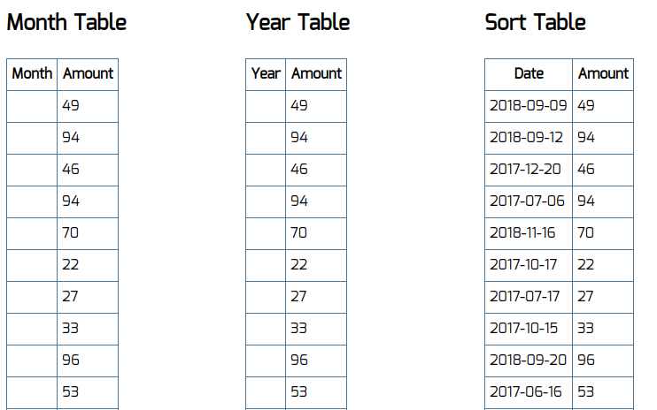

Агрегация данных для таблиц
===

Есть набор из трёх компонентов, которые выводят табличные данные: 
- с группировкой по месяцам за текущий год, 
- с группировкой по годам, 
- с сортировкой по убыванию. 



К сожалению, эти компоненты работают только с подготовленными данными, а API сервера статистики возвращает нам сырые данные — неотсортированные и несгруппированные.

Данные запрашиваются один раз (https://raw.githubusercontent.com/netology-code/ra16-homeworks/master/hoc/aggregation/data/data.json) — после загрузки страницы.
```js
{
  "list": [
    {"date": "2018-01-13", "amount": 10},
    {"date": "2018-02-13", "amount": 9},
    {"date": "2018-01-09", "amount": 5},
    {"date": "2017-12-14", "amount": 14},
    {"date": "2018-03-01", "amount": 13},
    //...
  ]
}
```

## Реализация

Обернуть компоненты таблиц в HOC, который бы производил над данными операции, приводящие их к нужному виду.
Также данные, которые группируются по дате, должны быть отсортированы по ней.

Компонент `MonthTable` ожидает данные в свойство `list` в следующем формате: 
```js
[{month: "Jan", amount: 100}, ...]
```

Компонент `YearTable` ожидает данные в свойство `list` в следующем формате: 
```js
[{year: 2018, amount: 100}, ...]
```

Компонент `SortTable` ожидает данные в свойство `list` в следующем формате: 
```js
[{date: "2017-12-14", amount: 14}, ...]
```

Воспользуйтесь готовым файлом `App.js` и стилями `css/index.css` из каталога в качестве отправной точки. Замените ими те, что создаются в create-react-app.
