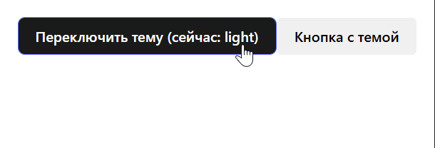

## HOC для управления темой

## 1. Описание задания

Вам предстоит реализовать компонент высшего порядка (HOC) `withTheme`, который предоставляет оборачиваемому компоненту текущую тему оформления через пропсы. Управление темой и её переключение реализовать в родительском компоненте, который передаёт тему вниз через пропсы, без использования React Context API.

### Усложнённый вариант (опционально)
- Реализуйте задание на TypeScript

## 2. Требования к функционалу

1. **HOC `withTheme`**

   - Принимает на вход React-компонент (функциональный или классовый).
   - Возвращает новый компонент, который:
     - Принимает проп `theme` (строка, например, `'light'` или `'dark'`).
     - Передаёт проп `theme` и остальные пропсы в оборачиваемый компонент.
   - Обеспечивает передачу актуального значения темы при изменении пропа `theme`.
   - Сохраняет имя исходного компонента для удобства отладки (`displayName`).
   - Опционально поддерживает `forwardRef`.

2. **Управление темой**

   - В родительском компоненте реализовать состояние `theme` с начальными значениями `'light'` или `'dark'`.
   - Добавить UI-элемент (например, кнопку или переключатель), который позволяет менять тему с `'light'` на `'dark'` и обратно.
   - Передавать текущее значение темы как проп `theme` в компонент, обёрнутый в `withTheme`.

3. **Применение темы**

   - Оборачиваемый компонент принимает проп `theme` и использует его для изменения стилей (цвет фона, цвет текста и т.п.).
   - При переключении темы стили компонента должны автоматически обновляться.



## 3. Технические детали

- Все данные о теме передаются через пропсы сверху вниз.
- HOC должен быть типизирован на TypeScript.
- HOC должен сохранять имя исходного компонента (`displayName`).
- Оборачиваемый компонент должен принимать проп `theme` и остальные пропсы без изменений.

## 4. Дополнительные рекомендации

- Для удобства можно определить тип темы как `type ThemeType = 'light' | 'dark';`.
- В родительском компоненте можно хранить объект с параметрами для каждой темы (цвета, стили).
- HOC просто прокидывает проп `theme` вниз — логика переключения и состояние темы в родителе.
- Можно реализовать поддержку `forwardRef` в HOC для удобства.

## 5. Структура проекта (пример)

```
src/
  hoc/
    withTheme.tsx      // реализация HOC
  components/
    ThemedButton.tsx   // пример компонента, оборачиваемого withTheme
  App.tsx
  types.ts   // содержит тип ThemeType
  index.tsx
```

## 6. Критерии оценивания
**Зачёт:**

- Реализован HOC withTheme, который:
   - Принимает компонент и возвращает новый с пропсом theme.
   - Корректно передаёт theme и остальные пропсы в оборачиваемый компонент.
   - Сохраняет displayName для отладки (например, WithTheme(Button)).
- В родительском компоненте (App или аналогичном):
   - Управление состоянием темы ('light' / 'dark') осуществляется через useState.
   - Реализован UI для переключения темы (кнопка/переключатель).
- Оборачиваемый компонент (например, ThemedButton) меняет стили при смене темы.


**На доработку:**

- Задание не выполнено.
- Ключевая функциональность не работает: withTheme не передаёт theme в оборачиваемый компонент.
- Состояние темы хранится в HOC, а не в родительском компоненте.
- Логика применения темы находится в оборачиваемом компоненте.
- Присутствуют ошибки в коде: прямая мутация состояния или неправильная типизация.
- В работе присутствуют ошибки, которые мешают приложению запуститься или корректно работать.
- HOC не возвращает компонент (например, забыт return).
