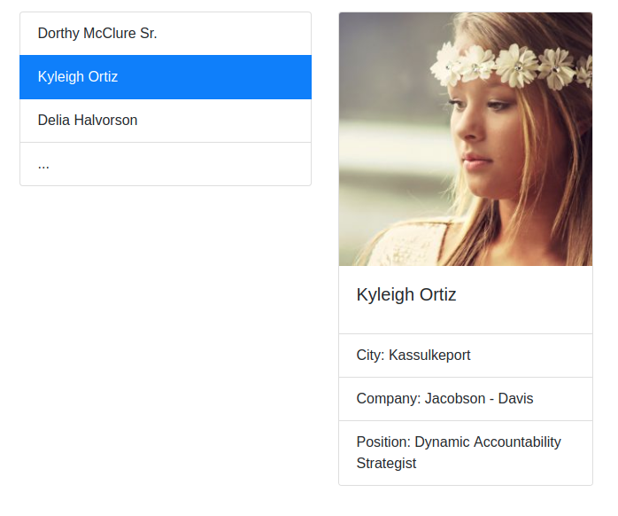
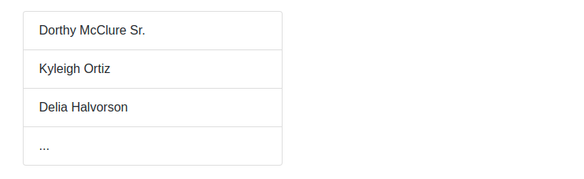

Список и детали
===

Вы решили потренироваться в использовании хука `useEffect` и реализовать следующее приложение - список с пользователями, при это при клике на пользователя рядом появляется окно, отображающее детальную информацию о пользователе:

При первой загрузке ни один из элементов не выбран, поэтому отображается только список:

## Механика

Назовём первый компонент (который слева) - `List`, а второй (который справа) - `Details`.

Реализуйте следующую логику:
* При загрузке приложения один раз делается запрос по адресу: https://raw.githubusercontent.com/netology-code/ra16-homeworks/master/hooks-context/use-effect/data/users.json и отрисовывается список в компоненте `List`
* При клике на конкретный элемент списка в компонент `Details` передаются один props: `info` (объект с полями `id` и `name`) и начинается загрузка данных по адресу: https://raw.githubusercontent.com/netology-code/ra16-homeworks/master/hooks-context/use-effect/data/{id}.json, где {id} - это id пользователя из props.
* На время загрузки можете отображать индикатор загрузки (протестируйте с помощью выставления ограничения пропускной способности сети в Dev Tools)

Важные момент:
1. Вся загрузка должна происходить через хук `useEffect`. Подумайте, как организовать единоразовую загрузку и загрузку при каждом изменении `props.info.id`
1. Обратите внимание, загрузка деталей должна происходить только при изменении `props.info.id`, а не при каждом рендере. Т.е. если на одного и того же пользователя кликнуть дважды, то загрузка произойдёт только в первый раз.