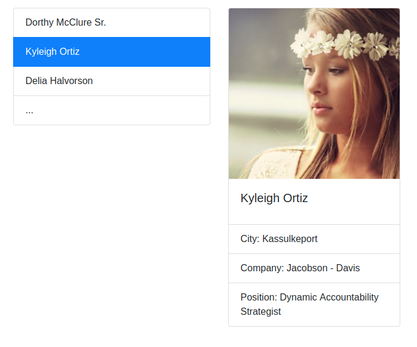
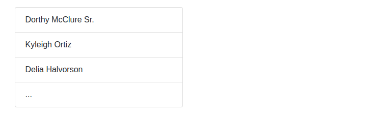

# Hooks & Context — use-effect

## Общее описание

Нужно реализовать приложение со списком пользователей.

* Слева отображается список имён.
* Справа — окно с подробной информацией о выбранном пользователе.

При первой загрузке показывается только список, справа окно пустое. Когда пользователь кликает по имени, справа подгружаются и отображаются его данные.

---

## Техническое задание

### Состав программы

* `App` — общий каркас страницы (две колонки).
* `List` — компонент со списком пользователей.
* `Details` — компонент, который показывает данные выбранного пользователя.

### Функциональные требования

* При первом отображении страницы выполнить запрос по адресу:
  `https://raw.githubusercontent.com/netology-code/ra16-homeworks/master/hooks-context/use-effect/data/users.json`
  и отобразить список пользователей в компоненте `List`.
* При клике на имя из списка в компонент `Details` передаётся объект `info` (с `id` и `name`) и выполняется запрос по адресу:
  `https://raw.githubusercontent.com/netology-code/ra16-homeworks/master/hooks-context/use-effect/data/{id}.json`
  где `{id}` — идентификатор выбранного пользователя.
* Пока данные загружаются, показывать индикатор загрузки.
* При ошибке запроса отображать понятное сообщение.
* Повторный клик на того же пользователя не должен перезапускать загрузку.

### Требования к коду

* Использовать React (функциональные компоненты).
* Для сетевых запросов использовать `fetch`.
* Вся загрузка должна быть реализована через `useEffect`:

  * один эффект для загрузки списка (один раз при старте),
  * другой эффект для загрузки деталей при изменении `props.info.id`.
* Логика разделена по компонентам:

  * `List` отвечает за список и выбор,
  * `Details` отвечает за отображение данных пользователя.
* Код должен быть простым и понятным.

### Требования к стилям

* Разместить два блока (`List` и `Details`) рядом друг с другом (например, с помощью CSS Grid или Flexbox).
* Список должен быть оформлен как вертикальный перечень элементов (можно использовать `ul`/`li`).
* Активный пользователь в списке должен визуально выделяться (цвет фона или рамка).
* Карточка с деталями должна иметь отступы и простое оформление (рамка или фон).
* Индикатор загрузки и сообщения об ошибках должны быть хорошо заметны.
* Допускается использовать простые inline-стили, CSS-модули или любую удобную методику.
