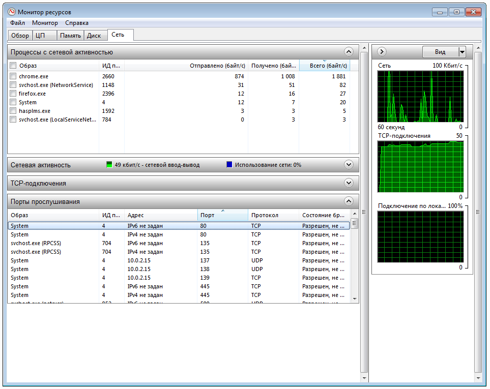
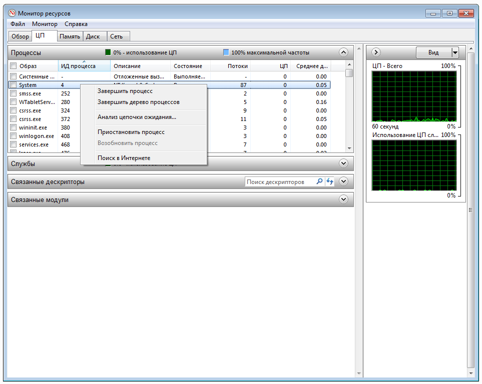

# Описание типичных проблем

## Проблемы с бэкендом

### Backend не запускается: address already in use

Это означает, что у вас уже есть процесс, который слушает на этом порту.

Убедитесь, что вы не пытаетесь с двух разных окон или терминалов запускать сервер, пусть он даже из разных домашек.

Варианта у вас два:
1. Поменять номер порта на фронтенде (.env) и бэкенде (server.js), после чего запустить заново оба через `npm start`.
1. Остановить то приложение, которое заняло порт (см. ниже).

#### Linux

В терминале запустите команды:
```sh
sudo apt-get install lsof
lsof -i :7070
```

Вывод будет выглядеть вот так
```
COMMAND  PID    USER   FD   TYPE  DEVICE SIZE/OFF NODE NAME
node    7377 student   21u  IPv6 7523278      0t0  TCP *:7070 (LISTEN)
```

7070 — номер порта, 7377 — номер процесса.

Процесс можно завершить с помощью команды:
```sh
sudo kill -9 7377
```

#### Mac OS

В терминале запустите команду:
```sh
$ lsof -i :7070
```

Вывод будет выглядеть вот так:
```
COMMAND  PID    USER   FD   TYPE  DEVICE SIZE/OFF NODE NAME
node    7377 student   21u  IPv6 7523278      0t0  TCP *:7070 (LISTEN)
```

7070 — номер порта, 7377 — номер процесса.

Процесс можно завершить с помощью команды:
```sh
sudo kill -9 7377
```

#### Windows

В Windows встроено приложение «Монитор Ресурсов» (Resource Monitor). Найдите его через «Пуск». Перейдите во вкладку сеть:



Найдите нужный процесс, запомните его идентификатор и перейдите на вкладку ЦП, где с помощью правой кнопки мыши выделите нужный и завершите:


