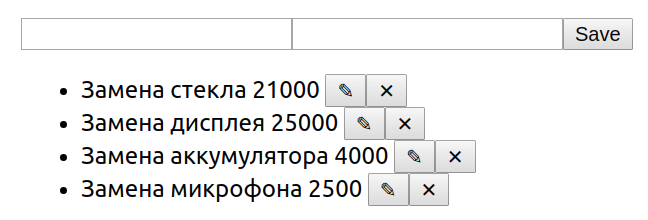

Редактирование
===

Данный проект не предполагает взаимодействия по протоколу HTTP и наличия серверной части.

Взяв за основу проект, рассмотренный на лекции, доработайте его следующим образом (либо напишите с нуля):

1. По умолчанию показывается форма добавления (при заполнении и нажатии на кнопку Save) происходит добавление элемента в список:

2. При нажатии на кнопку редактировать форма автоматически заполняется данными элемента

Далее возможны два сценария:

2.1 Если пользователь нажал на кнопк Save, запись в таблице обновляется

2.2 Если польователь нажал на кнопку Cancel, то поля вычищаются и снова отображается форма добавления

Бонусное задание: подумайте, как должно вести себя приложение, если вы при редактировании записи, нажмёте на удалить (крестик).
