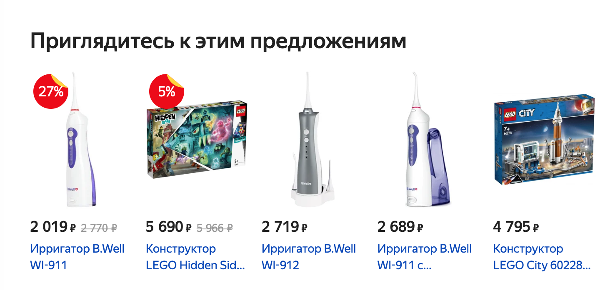

Каталог
===

Этот проект не предполагает взаимодействия по протоколу HTTP и наличия серверной части.

В этой задаче вы выступите в роли аналитика и проектировщика. На базе существующего сервиса вам самостоятельно необходимо спроектировать и реализовать на базе Redux форму добавления и отображения товаров. Важно: нас интересует только добавление и отображаение*.

Примечание*: редактирование и удаление делать не нужно.

Задача: разработайте на базе Redux форму добавления и отображения товаров как в Яндекс.Маркете.

Обратите внимание: на базе примера с лекции вы должны сами выступить в роли проектировщика и решить, какие поля и в каком виде — строка, число, boolean — вы будете хранить.

Задача вашего приложения — проектирование формы добавления и реализация списка для отображения:

Скриншот сервиса [Яндекс.Маркет](https://market.yandex.ru/).
