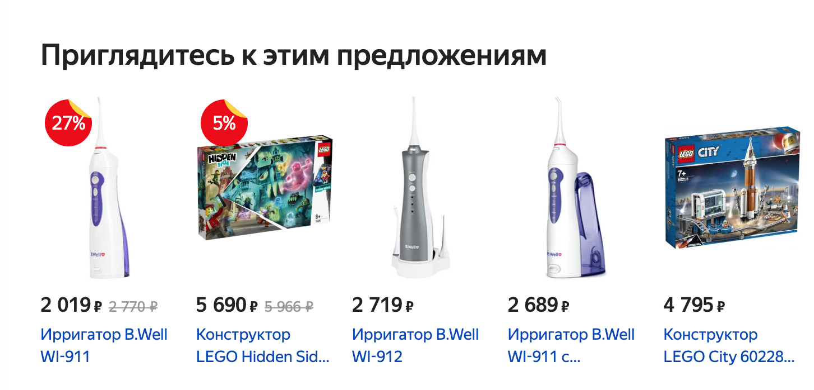

Каталог товаров
===

## Задача
Создать каталог товаров по образцу Яндекс.Маркета с возможностью добавления товаров и их отображения в виде карточек.

## Настройка проекта

Создайте новый проект:
```bash
npm create vite@latest market -- --template react-ts
cd market
npm install redux react-redux nanoid
npm run dev
```



## Анализ предметной области

### Структура данных товара
На основе анализа Яндекс.Маркета, товар должен содержать:

```typescript
interface Product {
  id: string;
  name: string;           // "iPhone 15 Pro 128GB"
  price: number;          // 99990
  originalPrice?: number; // 119990 (если есть скидка)
  category: string;       // "Смартфоны"
  brand: string;          // "Apple"
  rating: number;         // 4.8 (от 1 до 5)
  reviewsCount: number;   // 1247
  available: boolean;     // true/false
  imageUrl?: string;      // URL изображения
  description: string;    // "Смартфон с тройной камерой и процессором A17 Pro"
  features: string[];     // ["128GB", "Titanium", "5G", "Face ID"]
  isNew?: boolean;        // новинка
  hasDiscount?: boolean;  // есть скидка
}
```

## Функциональные требования

### Обязательная функциональность

**Форма добавления товара:**
- [ ] Название товара (текст, обязательно)
- [ ] Цена (число, обязательно, больше 0)
- [ ] Первоначальная цена (число, опционально, для отображения скидки)
- [ ] Категория (выпадающий список из предустановленных категорий)
- [ ] Бренд (текст, обязательно)
- [ ] Рейтинг (слайдер или звездочки от 1 до 5)
- [ ] Количество отзывов (число, по умолчанию 0)
- [ ] В наличии (чекбокс)
- [ ] Описание (текстарея, обязательно)
- [ ] Особенности (теги, можно добавлять/удалять)

**Отображение каталога:**
- [ ] Карточки товаров в сетке (3-4 колонки на десктопе)
- [ ] На карточке: изображение (заглушка), название, цена, рейтинг, наличие
- [ ] Отображение скидки (зачеркнутая старая цена + процент)
- [ ] Бейджи: "Новинка", "Скидка", "Нет в наличии"
- [ ] Счетчик товаров: "Показано товаров: X"

### Валидация
- [ ] Название: обязательное, минимум 3 символа
- [ ] Цена: обязательное, число больше 0
- [ ] Первоначальная цена: если указана, должна быть больше текущей цены
- [ ] Бренд: обязательное, минимум 2 символа
- [ ] Рейтинг: от 1 до 5
- [ ] Описание: обязательное, минимум 10 символов

### UI/UX требования
- [ ] Адаптивный дизайн (mobile-first)
- [ ] Визуально привлекательные карточки товаров
- [ ] Состояние загрузки при добавлении товара
- [ ] Уведомление об успешном добавлении товара
- [ ] Сортировка: по цене, по рейтингу, по названию

## Архитектура Redux

### Структура состояния
```typescript
interface RootState {
  products: {
    items: Product[];
    categories: string[];
  };
  form: {
    // Поля формы
    name: string;
    price: string;
    originalPrice: string;
    category: string;
    brand: string;
    rating: number;
    reviewsCount: string;
    available: boolean;
    description: string;
    features: string[];
    
    // Состояние формы
    isSubmitting: boolean;
    errors: Record<string, string>;
  };
  ui: {
    sortBy: 'name' | 'price' | 'rating';
    sortOrder: 'asc' | 'desc';
    notification: string | null;
  };
}
```

### Основные Actions
```typescript
// Управление товарами
ADD_PRODUCT          // { product: Product }
SET_SORT            // { sortBy: string, sortOrder: string }

// Управление формой
SET_FORM_FIELD      // { field: string, value: any }
ADD_FEATURE         // { feature: string }
REMOVE_FEATURE      // { index: number }
VALIDATE_FORM       // void
CLEAR_FORM         // void
SET_SUBMITTING     // { isSubmitting: boolean }

// UI
SHOW_NOTIFICATION   // { message: string }
CLEAR_NOTIFICATION // void
```

### Селекторы
```typescript
// Сортированный список товаров
export const selectSortedProducts = createSelector(
  [(state: RootState) => state.products.items, 
   (state: RootState) => state.ui.sortBy,
   (state: RootState) => state.ui.sortOrder],
  (products, sortBy, sortOrder) => {
    const sorted = [...products].sort((a, b) => {
      let comparison = 0;
      switch (sortBy) {
        case 'name': comparison = a.name.localeCompare(b.name); break;
        case 'price': comparison = a.price - b.price; break;
        case 'rating': comparison = a.rating - b.rating; break;
      }
      return sortOrder === 'desc' ? -comparison : comparison;
    });
    return sorted;
  }
);

// Статистика по товарам
export const selectProductStats = createSelector(
  [(state: RootState) => state.products.items],
  (products) => ({
    total: products.length,
    available: products.filter(p => p.available).length,
    withDiscount: products.filter(p => p.hasDiscount).length,
    avgRating: products.reduce((sum, p) => sum + p.rating, 0) / products.length || 0
  })
);
```

## Предустановленные данные

### Категории товаров
```typescript
const CATEGORIES = [
  'Смартфоны',
  'Ноутбуки', 
  'Планшеты',
  'Наушники',
  'Умные часы',
  'Фотоаппараты',
  'Телевизоры',
  'Игровые приставки'
];
```

### Примеры товаров для демонстрации
Добавьте в initialState несколько товаров для демонстрации интерфейса.

## Подсказки по реализации

1. **Дизайн карточек**: изучите карточки товаров на реальном Яндекс.Маркете
2. **Валидация**: создайте универсальную функцию `validateProductForm`
3. **Особенности товара**: используйте массив строк с возможностью добавления/удаления
4. **Изображения**: используйте заглушки или сервис placeholder.com
5. **Скидки**: вычисляйте процент скидки: `(originalPrice - price) / originalPrice * 100`

## Структура компонентов

```
components/
├── ProductForm/
│   ├── ProductForm.tsx       // основная форма
│   ├── FeatureInput.tsx      // ввод особенностей
│   └── RatingInput.tsx       // ввод рейтинга
├── ProductCatalog/
│   ├── ProductGrid.tsx       // сетка товаров
│   ├── ProductCard.tsx       // карточка товара
│   ├── SortControls.tsx      // сортировка
│   └── ProductStats.tsx      // статистика
└── UI/
    ├── Notification.tsx      // уведомления
    └── Badge.tsx             // бейджи (Новинка, Скидка)
```

## Дополнительные задачи (необязательно)
- [ ] Фильтрация по категориям и брендам
- [ ] Поиск товаров
- [ ] Избранные товары
- [ ] Сравнение товаров
- [ ] Пагинация или виртуальный скролл
- [ ] Загрузка реальных изображений
- [ ] Экспорт каталога в JSON
