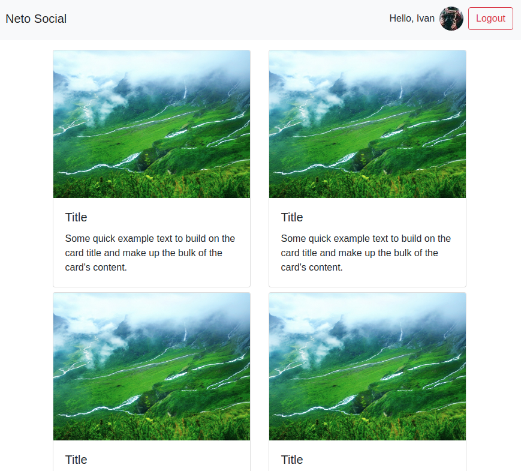
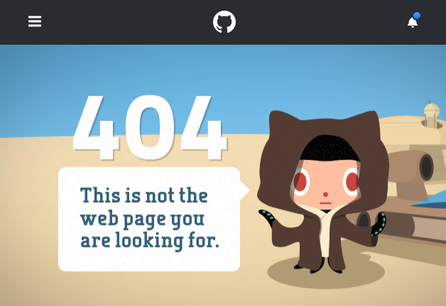

Authentication
===

Вы решили модернизировать систему с аутентификацией, используя знания, полученные о роутере.

Используя сервер, расположенный в каталоге `backend`, реализуйте следующее приложение, удовлетворяющее следующим условиям:

1. При первой загрузке показывается Landing-страница с формой входа (url = /):


2. После авторизации (POST http://localhost:7070/auth `{"username": "vasya", "password": "vasya"}`), загружаются компонент ленты новостей и в тулбаре отображается профиль с кнопкой выйти (url = /news):



Для запроса профиля используйте запрос вида:
```
GET http://localhost:7070/private/me
Authorization: Bearer <ваш_токен>
```

Для запроса новостей используйте запрос вида:
```
GET http://localhost:7070/private/news
Authorization: Bearer <ваш_токен>
```

3. При нажатии на кнопку выйти URL происходит редирект на главную страницу (url = /)

4. Каждая новость кликабельна, при клике на новость открывается страница, на которой показана только карточка этой новости (url = /news/{id}) 

5. Если пользователь не аутентифицирован, то попытка зайти на /news или /news/{id} должна приводить к редиректу на главную страницу (url = /)

Важно:
1. Профиль и токен должны храниться в localStorage/sessionStorage (при перезагрузке страницы должна так же загружаться лента новостей, если мы аутентифицированы)
1. Должна быть обработка ошибок, если получена ошибка 401 - то нужно разлогинивать пользователя (удалять всё из localStorage/sessionStorage)
1. Должна быть обработка ошибок, если получена ошибка 404 (например, пользователь в аутентифицированном режиме вручную вбил в адресную строку /news/00000000-0000-0000-0000-000000000000), то должна отрисовываться страница 404 - просто тулбар + большими буквами Not Found, например, как на GitHub:

