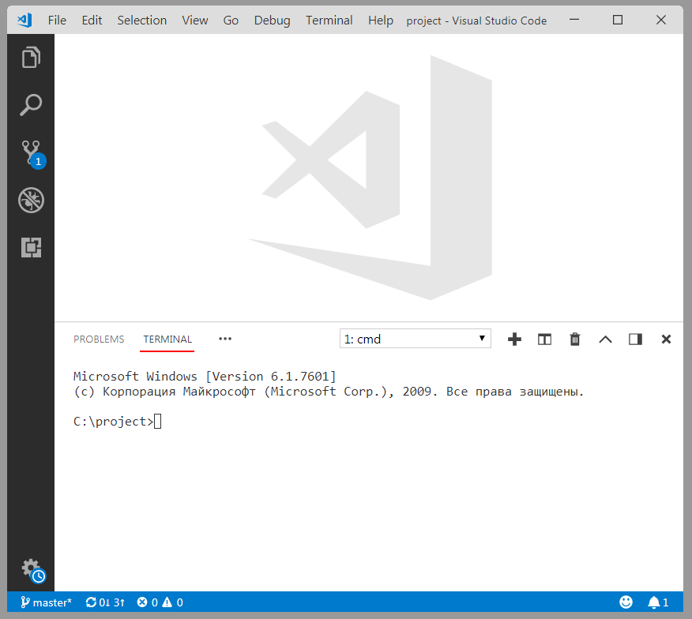

# Краткое руководство по работе с терминалом

* [Введение](#введение)
* [Открытие терминала](#открытие-терминала)
	* [VSCode](#vscode)
	* [Linux](#linux)
	* [Mac](#mac)
	* [Windows (Git Bash)](#windows-git-bash)
	* [Windows (Cmd/PowerShell)](#windows-cmdpowershell)
* [Пути](#пути)
* [Переменные окружения](#переменные-окружения)
* [Автодополнение](#автодополнение)
* [Ключевые команды](#ключевые-команды)
	* [Текущий рабочий каталог](#текущий-рабочий-каталог)
	* [Смена рабочего каталога](#смена-рабочего-каталога)
	* [Листинг каталога](#листинг-каталога)
	* [Создание файлов](#создание-файлов)
	* [Создание каталогов](#создание-каталогов)
	* [Перемещение файлов и каталогов](#перемещение-файлов-и-каталогов)
	* [Удаление файлов и каталогов](#удаление-файлов-и-каталогов)

## Введение

Данное краткое руководство демонстрирует основные команды в терминалах:
* Bash (Linux/Mac)
* Git Bash (Windows)
* Cmd (Windows)
* PowerShell (Windows)

Для удобства все команды будут приведены в трёх вариантах:
* Bash
* Cmd
* PowerShell

>В Windows 10 для оболочки Cmd также доступны команды из GNU CoreUtils (те, что используются в Bash). В данном руководстве, для обеспечения совместимости с Windows 7, мы их не будем использовать.


## Открытие терминала

Первая задача: открыть терминал сразу в нужном каталоге.

### VSCode

Самым простым решением этой задачи является использование редактора кода (большинство из них поддерживают эмуляторы терминала).

Так, в VSCode, который мы будем использовать в рамках этого курса, сочетание клавиш ``Ctrl + ` `` (Windows/Linux) либо ``⌃ + ` `` (Mac) позволяют сразу открыть терминал в каталоге, где расположен текущий проект:




При этом Вы можете выбрать используемый терминал:
https://code.visualstudio.com/docs/editor/integrated-terminal#_configuration

### Linux

В Linux достаточно щёлкнуть правой кнопкой мыши на каталоге и выбрать пункт меню `Open in Terminal` или `Открыть в терминале`:


### Mac

В Mac всё немного сложнее, необходимо настроить отображение этого пункта меню в Finder.

Для этого небоходимо перейти в `Системные настройки`, затем пункт меню `Клавиатура`, в разделе `Службы` выбрать раздел `Файлы и папки` и поставить флажок напротив `Новый терминал по адресу папки`:


После чего при клике правой кнопкой мыши на каталоге появится необходимый пункт меню:


### Windows (Git Bash)

В Windows всё достаточно просто, кликаете правой кнопкой мыши на каталоге и выбираете `Git Bash Here`:


### Windows (Cmd/PowerShell)

Если нужно открыть Cmd/PowerShell, то при нажатой клавшие `Shift` кликаете правой кнопкой мыши на каталоге и выбираете `Оpen command window here` или `Open PowerShell window here` (в русскоязычной версии они должны называться `Открыть окно команд здесь` и `Открыть окно PowerShell здесь` соответственно):


## Пути

Одно окно терминала подразумевает, что так же как в одном открытом окне `Nautilus`, `Finder` или проводника Windows вы можете в один момент времени находиться только в одном каталоге, который называется `Current Working Directory` (текущий каталог).

Вы можете выполнять команды относительно текущего каталога или относительно абсолютного пути.

Абсолютный путь — это путь, отсчитываемый от корня файловой системы. Корень файловой системы обозначается символом `/`. В Windows корень отсчитывается от диска, например, `C:\`.

> **Важно:** несмотря на то, что в Windows 10 командные оболочки нормально поддерживают `/` вместо `\ `, мы будем использовать для Windows синтаксис с `\ `.

Например, в Git Bash (Windows) абсолютный путь для каталога `Program Files`, будет чаще всего выглядеть следующим образом: `/c/Program Files/`, а в Cmd: `C:\Program Files\ `

Для домашнего каталога в Ubuntu (Linux), абсолютный путь будет выглядеть следующим образом: `/home/user/`, где `user` — имя пользователя.

Bash (Git Bash в том числе) используют символ `/` для разделения каталогов. В Windows для этих же целей используется символ `\ `.

Ещё два специальных обозначения помимо корня файловой системы:
* `.` — обозначает текущий каталог
* `..` — обозначает родительский каталог

**Важно:** в терминале символ пробел является символом разделяющим команды и опции. Поэтому если в пути есть пробел, то варианта два:
1. Заключать путь в кавычки, т.е. `"Program Files"`
1. Использовать символ `backslash` для экранирования пробела: `Program\ Files` (Linux/Mac)

## Переменные окружения

Командная оболочка устанавливает ряд переменных, которые выполняют специфические функции. Так, переменная с именем `PATH` содержит список путей, в которых будет производиться поиск программы, если вы наберёте её название в терминале.

Для вывода содержимого конкретной переменной используется команда `echo`.

#### Вывод переменной окружения:
**Bash**
```shell
$ echo $PATH
```
**Cmd**
```shell
> echo %PATH%
```
**PowerShell**
```shell
> $Env:Path
```

## Автодополнение

В командных оболочках работает автодополнение по клавише `Tab`:
* дополняются имена команд
* дополняются пути

Используйте автодополнение так как оно позволяет сократить время на набор команды.

## Ключевые команды

В этом разделе будут описаны ключевые команды, необходимые нам для работы. Естественно, список этот далеко не полный.

### Текущий рабочий каталог

`pwd` — сокращение от Print Working Directory.

#### Отображение текущего рабочего каталога:
**Bash**
```shell
$ pwd
```
**Cmd**
```shell
> cd
```
**PowerShell**
```shell
> pwd
> gl
```

### Смена рабочего каталога

`cd` — сокращение от Change Directory.

#### Переход в определённый каталог:
**Bash**
```shell
$ cd <path>
```
**Cmd**
```shell
> cd <path>
```
**PowerShell**
```shell
> cd <path>
```
`path` может быть как абсолютынм, так и относительным путём.

#### Перейти на каталог выше:
**Bash**
```shell
$ cd ..
```
**Cmd**
```shell
> cd ..
```
**PowerShell**
```shell
> cd ..
```

#### Перейти в подкаталог `src`:
**Bash**
```shell
$ cd src
```
**Cmd**
```shell
> cd src
```
**PowerShell**
```shell
> cd src
```

Если перед путём нет слеша — он трактуется как отосительный (относительно текущего каталога). 

### Листинг каталога

`ls` — сокращение от List.

#### Отображение листинга (содержимого каталога):
**Bash**
```shell
$ ls
```
**Cmd**
```shell
> dir
```
**PowerShell**
```shell
> ls
> dir
```

По умолчанию, `ls` не отображает файлы, начинающиеся с `.`, например, `.gitignore`. Для отображения таких файлов нужно использовать флаг `-a`:
```shell
$ ls -a
```

### Создание файлов

Для создания файлов используются специальные программы (например, для создания текстовых файлов — текстовые редакторы).

### Создание каталогов

`mkdir` — сокращения от Make Directory.

Позволяет создавать каталоги (создаст каталог `tmp` в текущем каталоге):
```shell
$ mkdir tmp
```

В оболочках Cmd и PowerShell описанный варианты команды `mkdir` работают аналогичным образом.

### Перемещение файлов и каталогов

`mv` — сокращение от Move.

#### Перемещение (переименование) файлов и каталогов:
**Bash**
```shell
$ mv tmp temp
```
**Cmd**
```shell
> move tmp temp
```
**PowerShell**
```shell
> mv tmp temp
> move tmp temp
```

### Удаление файлов и каталогов

`rm` — сокращение от Remove.

#### Удаление файла:
**Bash**
```shell
$ rm README.txt
```
**Cmd**
```shell
> del README.txt
```
**PowerShell**
```shell
> rm README.txt
> del README.txt
```

#### Удаление непустого каталога:
**Bash**
```shell
$ rm -rf temp
```
Для удаление непустого каталога необходимо указать флаги:
* `-r` — удалять рекурсивно
* `-f` — не спрашивать подтверждения

**Cmd**
```shell
> rd /S /Q temp
```
Для удаление непустого каталога необходимо указать флаги:
* `/S` — удалять рекурсивно все файлы и подкаталоги
* `/Q` — не спрашивать подтверждения

**PowerShell**
```shell
> rm -recurse -force temp
> rd -recurse -force temp
```
Для удаление непустого каталога необходимо указать флаги:
* `-recurse` — удалять рекурсивно все файлы и подкаталоги
* `-force` — включая скрытые и доступные только для чтения

