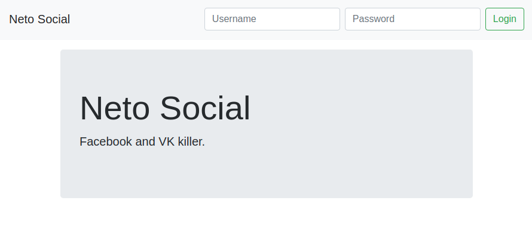

Authentication
===

Поскольку с Context API вы уже разобрались, пришло время разобраться и с Redux. Перепишите построенную вами систему на Redux (вы можете использовать на собственное усмотрение как чистый Redux с Side Effects, так и Redux + Redux Thunk).

Но мы, всё-таки рекомендуем потренироваться именно в использовании Redux Thunk, т.к. это более распространённый подход для работы с Side Effects.

Используя сервер, расположенный в каталоге `backend`, реализуйте следующее приложение, удовлетворяющее следующим условиям:

1. При первой загрузке показывается Landing-страница с формой входа (url - /):



2. После авторизации (POST http://localhost:7070/auth `{"username": "vasya", "password": "vasya"}`), загружаются компонент ленты новостей и в тулбаре отображается профиль с кнопкой выйти (пользователь переходит на страницу /news):


Для запроса профиля используйте запрос вида:
```
GET http://localhost:7070/private/me
Authorization: Bearer <ваш_токен>
```

Для запроса новостей используйте запрос вида:
```
GET http://localhost:7070/private/news
Authorization: Bearer <ваш_токен>
```

Важно:
1. Профиль и токен должны храниться в localStorage/sessionStorage (при перезагрузке страницы должна так же загружаться лента новостей, если мы аутентифицированы)
1. Должна быть обработка ошибок, если получена ошибка 401 - то нужно разлогинивать пользователя (удалять всё из localStorage/sessionStorage)
1. **Используйте React Router**, а не просто подменяйте компоненты в зависимости от текущего состояния аутентификации.
1. При разлогинивании пользователя должно перенаправлять на главную страницу (url - /)
